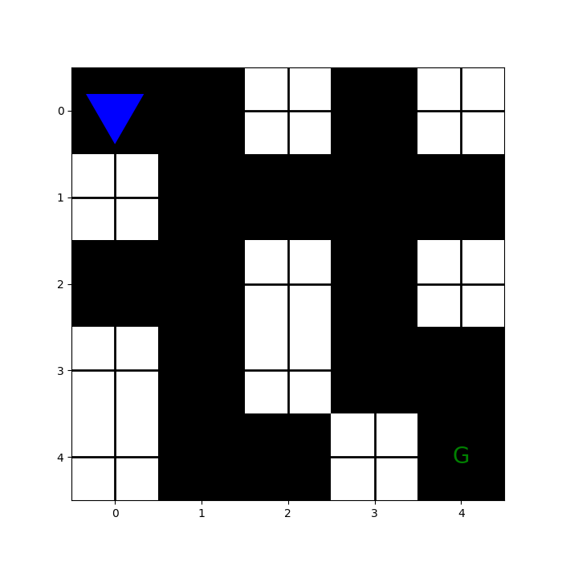

# 🧠 Maze Solver using Reinforcement Learning

This project demonstrates how an agent learns to solve a maze using Reinforcement Learning techniques like **SARSA**, **Q-Learning**, and **Deep Q-Learning**. The agent starts with no knowledge of the environment and learns optimal paths over time through trial and error.

## 🚀 Features

- Interactive maze environment
- Multiple RL algorithms implemented: SARSA, Q-Learning, Deep Q-Learning
- Training visualization
- GIFs showing progress **before and after training**
- Customizable maze sizes and reward structures

## 🎥 Demo

### 🔁 Before Training

### ✅ After Training

> Watch the agent go from clueless wandering to efficient maze-solving!

## 🧪 Algorithms Used

| Algorithm        | Description |
|------------------|-------------|
| **SARSA**        | On-policy TD control algorithm |
| **Q-Learning**   | Off-policy TD control algorithm |
| **Deep Q-Learning** | Uses a neural network to approximate Q-values |

## 🛠️ Tech Stack

- Python 🐍
- NumPy
- Matplotlib (for visualization)
- TensorFlow / PyTorch (for DQN)

## 📈 Results

The agent successfully learns to solve the maze in fewer steps over time. Training leads to:
- Better policy convergence
- Shorter paths
- Higher cumulative rewards

